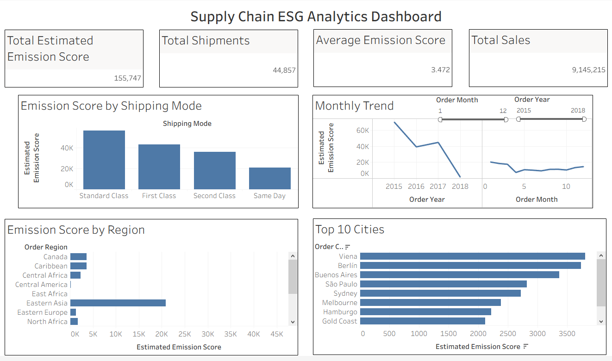

# esg-supplychain-bi
# Supply Chain ESG Analytics Platform

## Project Overview

This project is an Business Intelligence solution that analyzes supply chain logistics data to estimate carbon emissions and support sustainability reporting. It demonstrates the complete BI workflow from business requirements gathering to data transformation, dashboard development, and executive reporting.

---

## Business Problem

A global retail company stores logistics data across multiple systems, making it difficult to understand the environmental impact of its supply chain. The stakeholders require a centralized dashboard to monitor estimated carbon emissions, identify high emission transport operations, and support ESG reporting.

---

## Project Objectives

- Centralize logistics and sustainability data
- Estimate carbon emissions using business rules
- Build an executive ESG dashboard
- Identify high-emission transport modes and regions
- Support data-driven sustainability decisions

---

## Tech Stack

- Google BigQuery
- SQL
- Tableau Public
- Git
- GitHub
- Google Cloud Platform

---

## Project Workflow

Raw Logistics Dataset

↓

BigQuery

↓

SQL Data Cleaning & Transformation

↓

ESG Analytics Table

↓

Tableau Dashboard

↓

Business Insights & Recommendations

---

## Key Performance Indicators

- Total Estimated Emission Score
- Total Shipments
- Average Estimated Emission Score
- Total Sales
- Emissions by Shipping Mode
- Emissions by Region
- Monthly Emission Trend
- Top 10 Highest Emission Cities

---

## Dashboard Preview



---

## Repository Structure

```text
architecture/
dashboard/
data/
docs/
etl/
presentation/
sql/
README.md
LICENSE
```

---

## Business Value

This solution enables decision-makers to:

- Monitor estimated supply chain emissions
- Compare transport mode emissions
- Identify regional emission hotspots
- Support ESG reporting initiatives
- Improve operational sustainability

---

## Author

Syed Safwan Hashmi